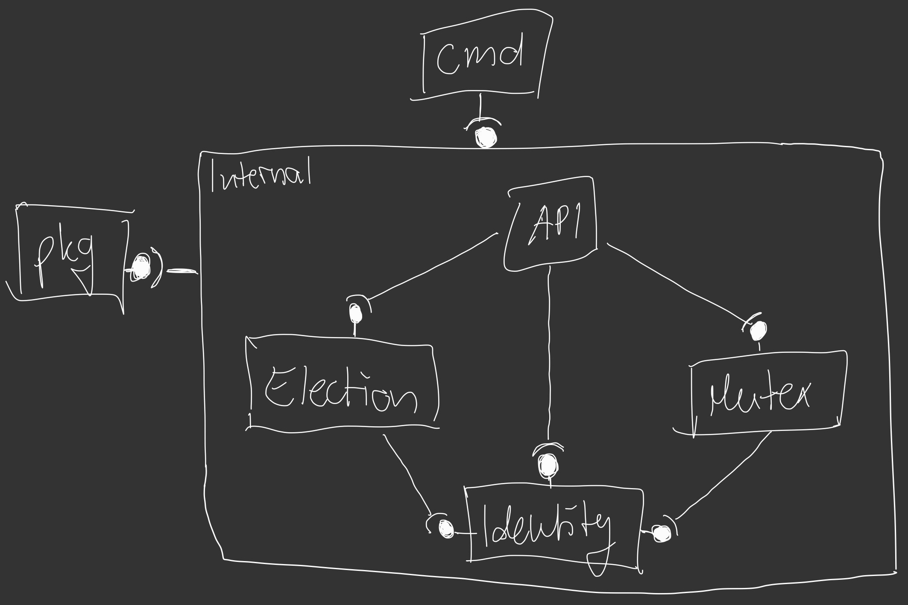

# goBully

Learning project to understand how to implement the bully algorithm and a distributed mutex with docker containers

This project implements the bully algorithm as well as a distributed mutex with docker containers
Several containers are served, each of which is accessible over a REST API
For more information about that, take a look at the code comments and the swagger documentation `task swagger`.

Details about the implementation of the Bully algorithm and the distributed mutex are shown below  

## Install

1. **GO** [installation](https://golang.org/doc/install) getting started - *run project binary*  
2. **Docker** [installation](https://docs.docker.com/get-docker/) getting started - *be able to run docker containers*
3. **Task** [installation](https://taskfile.dev/#/installation) doc - *build tool Taskfile.yml*
4. **Go Swagger** [installation](https://goswagger.io/install.html) doc - *swagger api documentation*

## Build

execute commands within the project root directory

### Check commands

```shell
task --list
task: Available tasks for this project:
* build:        Build docker container
* run:          Start docker container
* sdown:        Stop docker-compose scenario
* sup:          Start docker-compose scenario
* swagger:      Generate swagger.yml and start local server
* update:       Update project dependencies
```

### Run commands

```shell
// run listed commands
task <task>
// like
task build
```

### Stop Docker container leonardpahlke/gobully:latest

```shell
docker stop $(docker ps -a -q --filter ancestor=leonardpahlke/gobully:latest --format="{{.ID}}")
```

## Features

- docker container as user in the network to run the bully algorithm
- bully algorithm scenario with docker-compose simulated
- detailed swagger documentation [Swagger yml](api/swagger.yml) with [go-swagger](https://github.com/go-swagger/go-swagger)

## Project folder structure

```shell
── goBully
├── api
│   └── swagger.yml             // swagger api dcumentation
├── assets
│   └── goBully.jpg             // pictures and stuff
├── cmd
│   └── main.go                 // starting point of the application
├── internal
│   ├── election
│   │   ├── election.go         // election private functions
│   │   └── election_client.go  // election public functions
│   ├── identity
│   │   ├── register.go         // user register workflow
│   │   └── user.go             // user definition
│   ├── api
│   │   ├── doc.go              // rest general documentation info
│   │   ├── rest_client.go      // api setup
│   │   ├── rest_election.go    // election rest endpoints
│   │   ├── rest_mutex.go       // mutex rest endpoints
│   │   └── rest_user.go        // user rest endpoints
│   └── mutex
│       ├── mutex.go            // mutex private functions
│       └── mutex_client.go     // mutex public functions
├── pkg
│   └── request.go              // rest http calls
├── .gitignore
├── docker-compose.yml          // docker-compose szenario
├── Dockerfile                  // docker container script
├── Taskfile.yml                // build scripts
├── go.mod                      // go module information
├── go.sum                      // go module libary imports
└── README.md
```

**Project Dependencies**


## Bully Algorithm implementation

Scenario info:

- user1 -> null
- user2 -> user1
- user3 -> user1

If a user connects to another (register to network), new user information gets send to all network participants


`internal/election/election.go`

- receiveMessage()            // get a message from a api (election, coordinator)
- receiveMessageElection()    // handle incoming election message
- sendMessageElection()       // send a election message to another user
- receiveMessageCoordinator() // set local coordinator reference with incoming details
- sendMessagesCoordinator()   // send coordinator messages to other users

### Election details

**receiveMessageElection** - election message received

1. filter users to send election messages to (UserID > YourID)
2. if |filtered users| <= 0
2.1 YES: you have the highest ID and win - send coordinatorMessages - exit
2.2 NO: transform message and create POST payload
2.3 add user information to local callbackList
2.4 GO - sendElectionMessage(callbackResponse, msgPayload)
2.4.1 send POST request to client
2.4.2 if response is OK add client to client who have responded responded
2.5 wait a few seconds (enough time users can answer request)
2.6 Sort users who have called back and who are not
2.7 if |answered users| <= 0
2.7.1 YES: send coordinatorMessages
2.8 remove all users how didn't answered from userList
2.9 clear callback list
3. send response back (answer)

## Mutex implementation

It goes like this with 3 clients (**A**,**B**,**C**):

- Client **A** wants to enter the critical section
- **A** sends _request_ with his clock to **A**,**B**,**C**
- **B** is currently `in` the critical section, does store the _request_
- **C** is `idle` and sends _reply-ok_
- **A** sends himself an _reply-ok_
- **C** wants to enter the critical section & sends _request_ to **A**,**B**,**C**
- **A** `waits` for the mutex and his request has a lower clock, therefore stores the _request_
- **B** is `in` the critical section, therefore stores the _request_
- **B** finishes his critical section
- **B** sends _reply-ok_ to the stored requests of **A** and **C**
- **A** got all required _reply-ok_ and may now enter the critical section
- **C** still `waits`.
- **A** has finished his critical section and sends _reply-ok_ to the stored request of **C**
- **C** got all required _reply-ok_ and may now enter the critical section

`internal/mutex/**`

### Mutex details

**requestCriticalArea** - tell all users that this user wants to enter the critical section

1. set state to 'wanting'
2. increment clock, you are about to send mutex-messages
3. create a request mutex-message
4. create a response channel for every user (including yourself)
5. create new object to manage responses of this request (containing all user response channels)
6. add new requestResponseChannel to replyOkwaitingList
7. GO - send all users the request mutex-message
8. wait for all users to reply-ok to your request
9. remove the waiting reponses object from the list
10. enterCriticalSection()

**sendRequestToUser** - send request message to a user

1. send POST to user and wait for reply-ok answer
2. start checking if user answered

**checkClientIfResponded** - listen if client reply-ok'ed and check with him back if not

1. GO - clientHealthCheck() - sends periodic beats to check whether the user has responded
2. receiving message send through the channel
3. if message is reply-ok, return
4. ping user mutexState
5. wait some time to get response back
6. if answered: loopback to 2.
7. remove user from waiting list
8. delete user from local user management (inactive)
