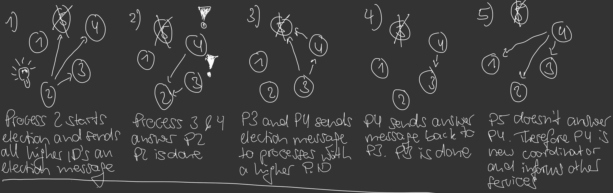

# goBully

docker container as users

container with api for election and discovery

create multiple containers with docker-compose

**election.go**

	- ReceiveMessage()             // get a message from a service (election, answer, coordinator)
	- SendAnswerMessage()          // callback to service
	- SendElectionMessage()        // send a service an election message and wait for response
	- SendCoordinatorMessages()    // send a service that you are the coordinator now
      ---------------------
	- ElectionMessageReceived()    // handle election message
	- CoordinatorMessageReceived() // handle coordinator message

